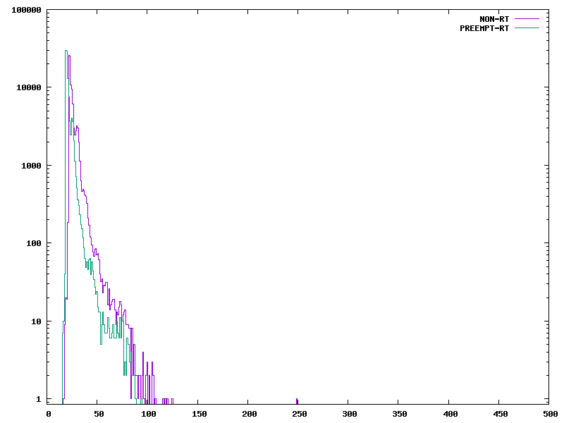

<h1>Homework 06<h1>

<h2>Watch<h2>

1. Julia Cartwright works at National Instruments. 
2. PREEMPT_RT is a patch that makes Linux into a real time system. This is done when embedded projects call for a real-time operating system.
3. Mixed criticality is running a mix of time critical and non time critical tasks.
4. Drivers can misbehave because the drive stacks are shared between real-time tasks and non real-time tasks.
5. Delta in Figure 1 represents the time at which an external event occurs to when the real-time task executes.
6. Cyclictest is used to find the delta value by taking timestamps when a thread sleeps and wakes up. Delta is the difference between the two values and the sleep duration.  
7. Figure 2 compares preempt and preempt_rt on the same hardware.
8. Dispatch latency is the time between the hardware firing and the relevent thread waking up. Scheduling latancy is the time between the tread waking up and the task executing on the CPU. 
9. Mainline is the model for how tasks will run.
10. The low priority interupt is keeping the external event in Figure 3 from starting.
11. The external event in Figure 4 can start sooner with irq threads.

<h2>Preempt_Rt<h2>

<h3>Test 1 - Load<h3>

| non rt |         |
|------|-----------|
| real | 1m59.073s |
| user | 0m1.348s  |
| sys  | 0m4.097s  |

| rt |             |
|------|-----------|
| real | 1m44.458s |
| user | 0m1.063s  |
| sys  | 0m4.043s  |

<h3>Test 2 - No Load<h3>

| non rt |         |
|------|-----------|
| real | 1m44.024s |
| user | 0m1.069s  |
| sys  | 0m3.256s  |

| rt |             |
|------|-----------|
| real | 1m44.866s |
| user | 0m0.861s  |
| sys  | 0m3.159s  |

